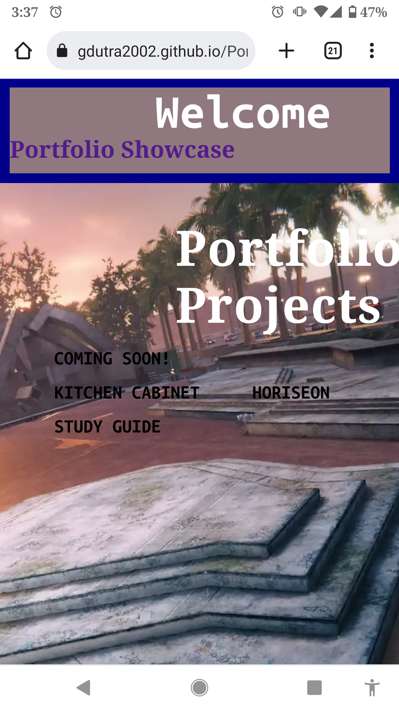

# Portfolio
## Description

This is my professional full stack portfolio. It will be continualy updated as I advance my web development skills to showcase my best work.

## Installation

https://gdutra2002.github.io/Portfolio/

## Usage

## Credits

This work originated from my assignments within the UCD bootcamp.  Additionaly there are some group and personal projects I would like to showcase.  See individual credits within each project.

## License

MIT license

## Badges

## Features

Click thru the page and find out!

## How to Contribute

Contact me at LinkedIn for correspondance. 